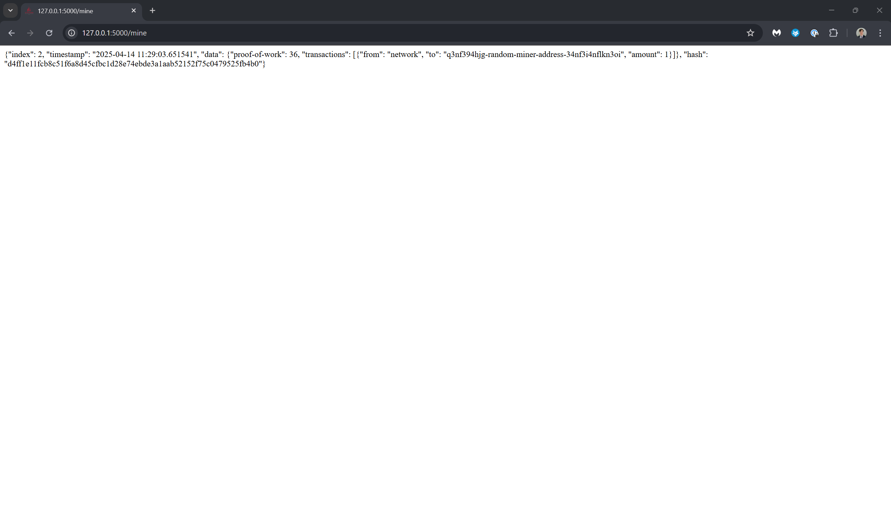

# Lab 10
## CPE 322 - A

Run hash_value.py twice
```sh
$ ~/iot/lesson10$ python3 hash_value.py
The hash for 1 is: 1
The hash for 1.0 is: 1
The hash for 3.14 is: 322818021289917443
The hash for Python is: 493358734425098262
The hash for a tuple of vowels is: -6495237399082241824
The hash for an object of person is: 7041767317191743946
$ ~/iot/lesson10$ python3 hash_value.py
The hash for 1 is: 1
The hash for 1.0 is: 1
The hash for 3.14 is: 322818021289917443
The hash for Python is: -5311723122501288390
The hash for a tuple of vowels is: -8746963518092652657
The hash for an object of person is: 3012235703482278782
```

Run snakecoin.py
```sh
$ ~/iot/lesson10$ python3 snakecoin.py
Block #1 has been added to the blockchain!
Hash: 12f5886dffa7bb11e3b7b86b2e49b7a2825e397c347ca2bd4d6a405b07efcaa6

Block #2 has been added to the blockchain!
Hash: 80d5bb35deadbe0822d571c8b6ad34400bca34dc4a7ac49dcb37a2b889fc65d7

Block #3 has been added to the blockchain!
Hash: 36a498b8f6c442e6801755516d34e62f5ba538b129ee24c092ee62a099d24269

Block #4 has been added to the blockchain!
Hash: bf93e691909e2d5d3b0e3460c920b01963441f8536d0aca29679eabe4010e5ae

Block #5 has been added to the blockchain!
Hash: 5c35b71e683acbbe385c36099fdddf83d02611efb971c55e6cc541a2d110cda2

Block #6 has been added to the blockchain!
Hash: 96de76ea6632c5c9b9e9ac0722709e825b5a25212b515a8767accfebd2830d54

Block #7 has been added to the blockchain!
Hash: 4e1e99c8e3551071e8bbff1263c990f45a0a45964b54337284d1d9746718334e

Block #8 has been added to the blockchain!
Hash: 1ed13927fab6e71ed7b43cb2a6afb1298b4b306c7d8d65a74662b36dbc419b0c

Block #9 has been added to the blockchain!
Hash: 5a64a3e1631d94b54b4dc95d2bfd79c5f47eeab515a537c394f124e4c3fc770c

Block #10 has been added to the blockchain!
Hash: 8fea61ec0f11e74927ad788cc2bc67f09176515d0d20992bc69294ab78e05900

Block #11 has been added to the blockchain!
Hash: 34e2a914e31e3b0b6e8fd09e5232a036dfead4bb482166fdb8ba559215f3ed69

Block #12 has been added to the blockchain!
Hash: b2fda94945d6e8556c22ffd024661bb353c6295a8822d86ed64a439e002f920f

Block #13 has been added to the blockchain!
Hash: 8b0015836aa76b37785eb833637b629473f28940023b50d934c1e386377a996c

Block #14 has been added to the blockchain!
Hash: b47d231af52b0264c34629d904dc2f097b163267511b7ff52f652e6a71729ea7

Block #15 has been added to the blockchain!
Hash: 17aa3abdf347d768f2a48e06a11fed6d1f1e91043ea409bdbc6ce1a9973c635f

Block #16 has been added to the blockchain!
Hash: ae7dc18446f6d4931e80f151a873ec413738dd0bee99a9e6bdb9fece1a0c020d

Block #17 has been added to the blockchain!
Hash: e14f25d5a373191de0caa53505c02b39e73def7dc3d3d7b44c0f83d326b40f47

Block #18 has been added to the blockchain!
Hash: d0b35ca5da1d043aea848582244c582f9a5fa592310c65fedaab9e55cb3ad2ff

Block #19 has been added to the blockchain!
Hash: 215601c03ba966b7e5e27fb6955609b033484c55e7e41756b3b91112bc942a4c

Block #20 has been added to the blockchain!
Hash: 8793d0e6bd8d142f04b496e3492eee70a725249b6572ab06c3429910c232c426
```

Run python snakecoin-server-full-code.py
```sh
$ ~/iot/lesson10$ python3 snakecoin-server-full-code.py
 * Serving Flask app 'snakecoin-server-full-code'
 * Debug mode: off
WARNING: This is a development server. Do not use it in a production deployment. Use a production WSGI server instead.
 * Running on http://127.0.0.1:5000
```
Image of the server running:


Navigate to http://127.0.0.1:5000/mine to mine a block

The image above shows the block mined and added to the blockchain with the index of the block.

Now clone the repository and go into python_blockchain_app, uncomment the last line in node_server.py and run the server
```sh
$ git clone https://github.com/bdx-bdx/python_blockchain_app.git
$ cd python_blockchain_app
$ nano node_server.py
$ python3 node_server.py
```

In a new terminal, run the client
```sh
$ cd python_blockchain_app
$ python3 run_app.py
```

Image of the website from the server running:


To mine a block, enter the content and your, name, then press post. After that press request to mine then resync - your block will be added to the blockchain and displayed on the website.


