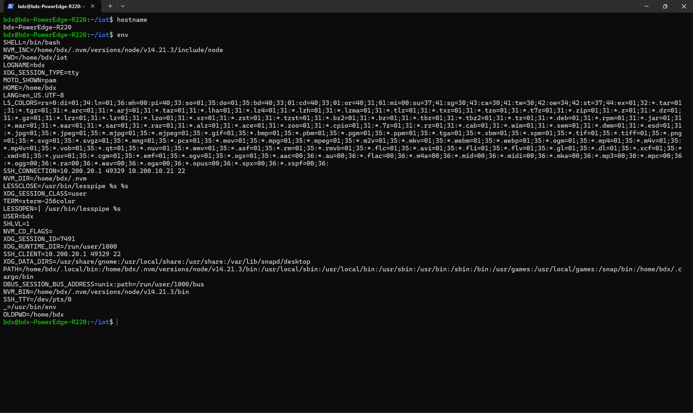
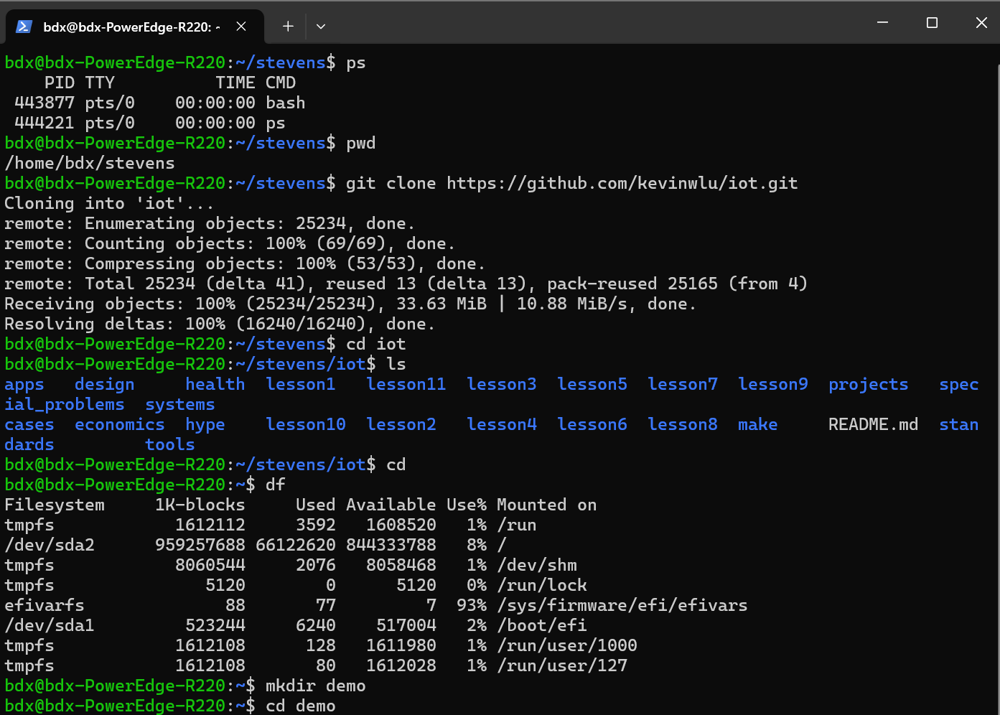
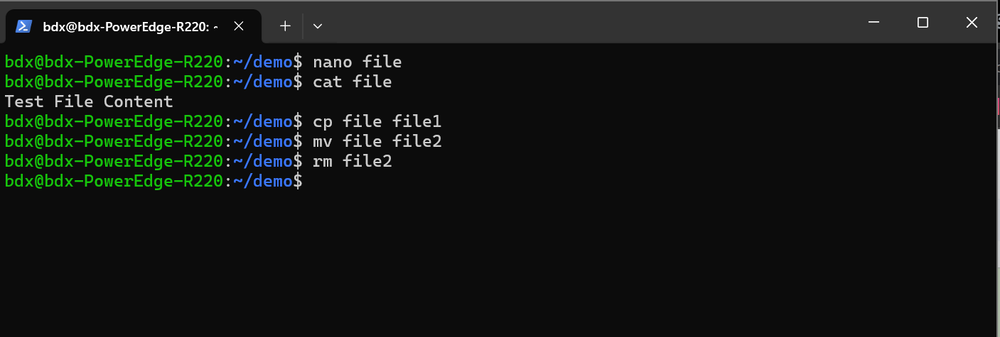
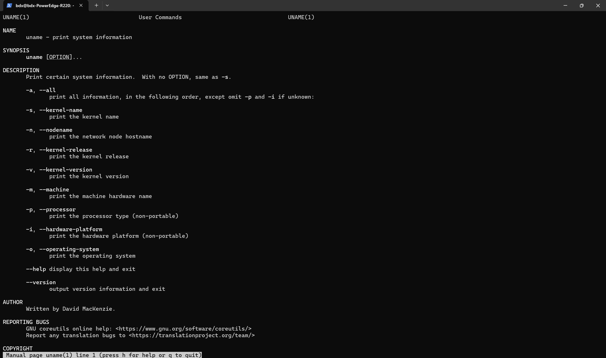
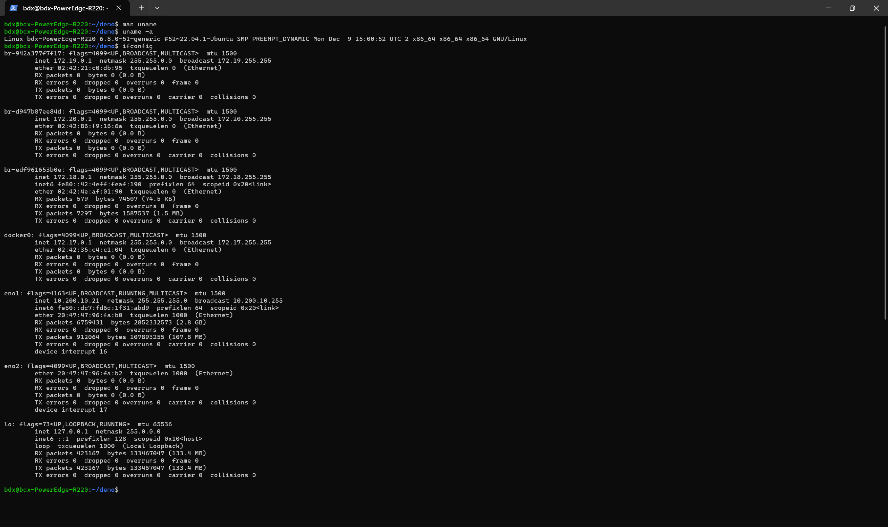
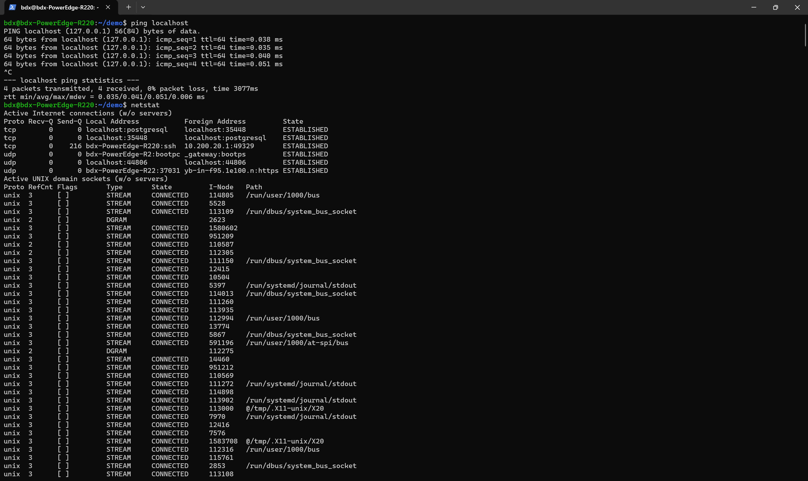

# CPE 322 A Lab 2: Command Line

##
- hostname 
- env

##
- ps
- pwd
- git clone https://github.com/kevinwlu/iot.git
- cd iot
- ls
- cd
- df
- mkdir demo
- cd demo

##
- nano file
- cat file
- cp file file1
- mv file file2
- rm file2

##
- clear
- man uname

##
- uname -a
- ifconfig

##
- ping localhost
- netstat
